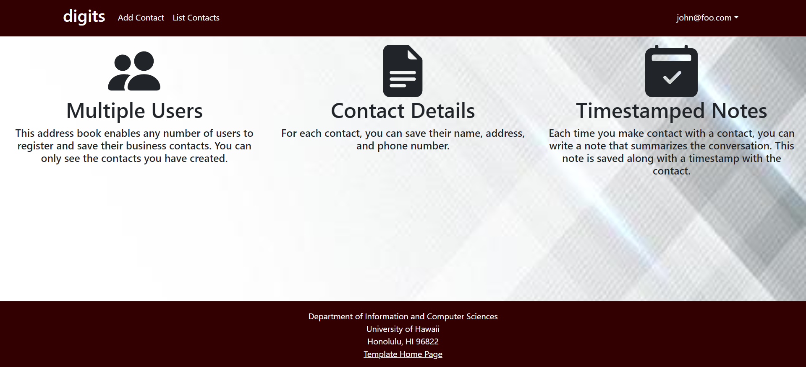
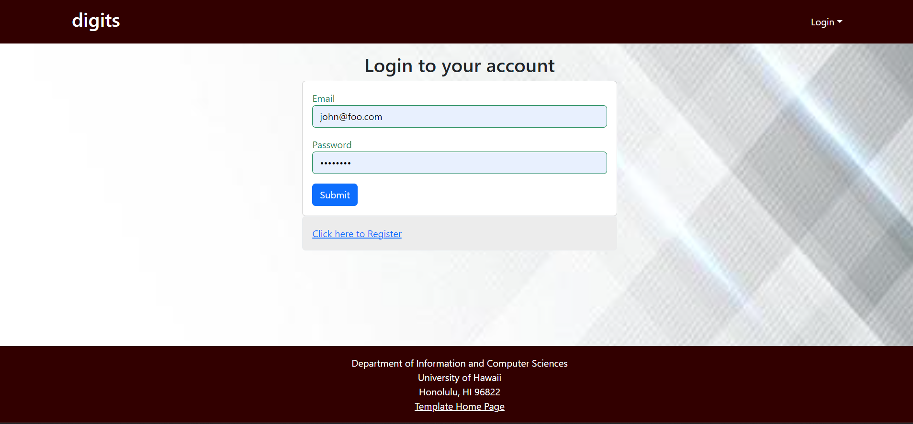
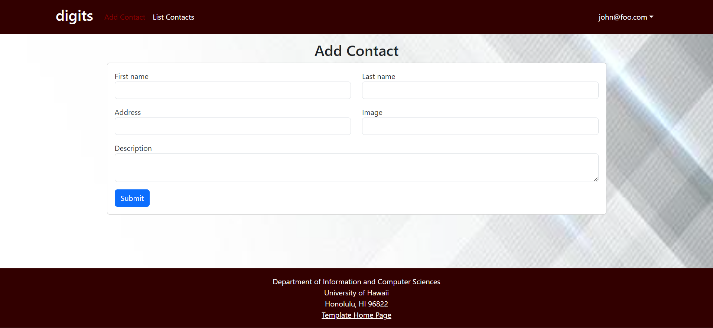
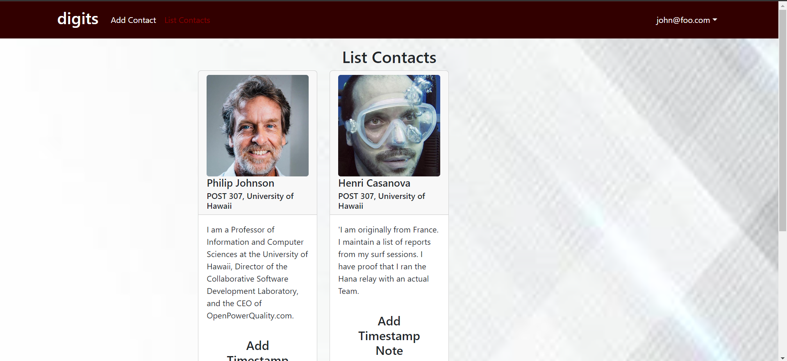

Welcome to Digits. Digits is a helpful app that allows you to keep track of contacts as well as keep Timestamps of these Contacts. 

First, log into your account or register. Once you've done this, you will have access to the Add Contact and List Contact pages.

To add a contact, you can use the Add Contact tab. You will be instructed to fill out the required criteria.

To list your current contacts, edit your contacts, or add timestamps, go onto the list contacts.

Enjoy digits: An easy way to store your contacts!
